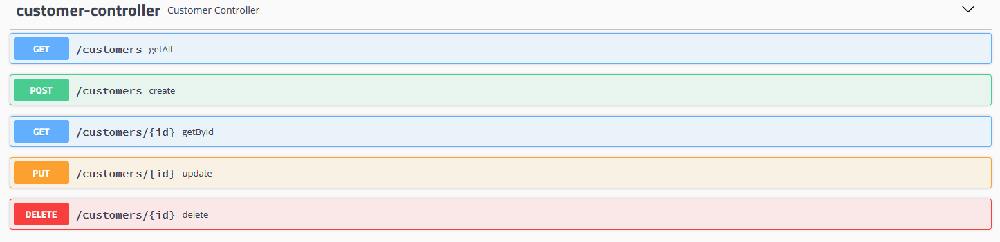

## Library app


Spring Boot application for library.

### Technologies : #

- Java 17
- Docker (last stable version)
- Spring Boot 2.7.6
- Maven 3.8.6

### Installation : #

- Run PostgreSQL database with docker by using the following command:

```
- docker run -d --name postgres -p 5432:5432 -e POSTGRES_PASSWORD=YOURPASSWORD postgres:15.1
```

#### Creating Postgres roles :

- Run SQL command:

```
CREATE USER dev WITH PASSWORD 'dev';
CREATE USER test WITH PASSWORD 'test';
```

#### Creating database
- Run SQL command:

```
CREATE DATABASE libraryapp_dev;
CREATE DATABASE libraryapp_test;
```

### Run : #

There are two profiles for app development and testing:
- dev
- test

To run application with dev profile use VM option: 
```
-Dspring.profiles.active=dev
```
### Endpoints : #





